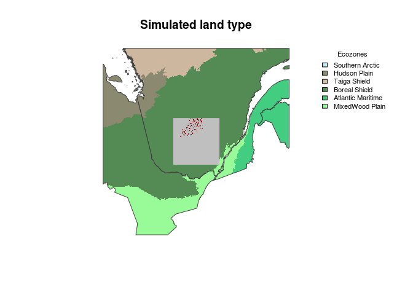
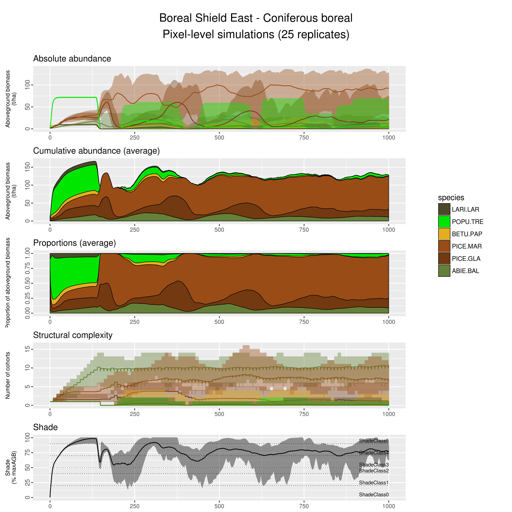

# Boreal Shield East - Softwood Boreal
Dominic Cyr  
Updated on May 31 2016

-------


### Context

This document presents pixel-level simulations of one specific land type chosen among the 80 land types defined for that quadrat. It was subjectively chosen among the most common land types to represent one general type of ecosystem.

We use such pixel-level simulation to assess the realism of emerging succession as simulated by [_LANDIS-II Biomass Succession_][1], to minimise biases as best as we can and document remaining ones.




-------

### Eastern Boreal Shield - Mesic Softwood Boreal 


* In the figure below, note that some panels present average values AND enveloppes, while others only present average values.

* The number of cohorts lumped into 10-yrs age classes is used as a proxy for __structural complexity__. That is only an indicator as some cohorts may be present in negligible amounts, especially those that established under already dense canopy.

* In _LANDIS-II Biomass Succession_ the percentage of maximum aboveground biomass occupied thoughout the simulation is used as a __proxy for shade__. Shade thresholds must be defined by the user to create shade classes that may limit the establishment of species based on their shade tolerance. The shade tolerance and other important traits of all species included in landscape-scale simulations are presented in the table below. As our simulations are currently parameterized, a given species establishment becomes limited when site shade classe reaches a value equal to shade tolerance of that species. Establishement becomes impossible when shade class exceed it.

-------

### Simulation setup

* A combination of 5 or 6 species start to growth from bare ground and interact for 1000 years with unlimited seed supply. The emerging succession is presented below.

* The pixel size is 6.25 ha. (250-m resolution)

* No disturbances occur in those simulations.

* One cohort of each species is established at the beginning of each simulation. That is important to consider as that may differ from what mostly occur in nature, where cohort establishment may be delayed for some species, especially after large-scale disturbances and where species are distributed in highly contageous manners.

* Because seed sources are not limiting in those simulations, any locally extinct species can come back later in the simulations.

* Species- and land types-specific parameters, maximum annual aboveground biomass, maximum annual net primary productivity, and species establishment probability are derived from stand-level model PICUS. The procedure is described [here][2]. 

-------

### Pixel-level simulation results



-------

### Simulated species and final parameters

Only a subset of the following species are included in the pixel-level simulations presented above. However, the following listed species are all those included in landscape-level simulations.

A few important parameters associated with each species are also presented. 

Please note that these parameters are subject to imprecision and/or subjectivity. Moreover, they are shared among all simulated land types. A perfect parameterization is therefore virtually impossible to achieve.


```
##                       CommonName MaxLongevity SexualMaturity
## ABIE.BAL              Balsam fir          150             30
## ACER.RUB               Red maple          150             10
## ACER.SAH             Sugar maple          300             40
## BETU.ALL            Yellow birch          300             40
## BETU.PAP             White birch          150             20
## FAGU.GRA          American beech          250             40
## LARI.LAR                Tamarack          150             40
## PICE.GLA            White spruce          200             30
## PICE.RUB              Red spruce          300             30
## PICE.MAR            Black spruce          200             30
## PINU.BAN               Jack pine          150             20
## PINU.RES                Red pine          200             40
## PINU.STR      Eastern white pine          300             20
## POPU.TRE         Trembling aspen          150             20
## QUER.RUB                 Red oak          250             30
## THUJ.SPP.ALL Eastern white-cedar          300             30
## TSUG.CAN         Eastern hemlock          300             60
##              ShadeTolerance mortalityShape growthShape
## ABIE.BAL                  5             25           0
## ACER.RUB                  3             25           0
## ACER.SAH                  5             15           1
## BETU.ALL                  3             15           1
## BETU.PAP                  2             25           0
## FAGU.GRA                  5             15           1
## LARI.LAR                  1             25           0
## PICE.GLA                  3             15           1
## PICE.RUB                  4             15           1
## PICE.MAR                  4             15           1
## PINU.BAN                  1             25           0
## PINU.RES                  2             15           1
## PINU.STR                  3             15           1
## POPU.TRE                  1             25           0
## QUER.RUB                  3             15           1
## THUJ.SPP.ALL              5             15           1
## TSUG.CAN                  5             15           1
```

### Important parameters - Additional information

__MaxLongevity__ and __SexualMaturity__ are relatively well documented parameters. They are nevertheless subjective as a single value must be chosen for each species despite the range of simulated environmental conditions that may affect their expression in nature. Also, in Landis these values apply to cohorts, not to individual stems. That level of abstraction forced us to seek for a balance between quantitative information, often influenced by exceptionnal individual cases (ex. record holders), and local expert knowledge, which is more informative of the most commonly found situations in nature. These paremeters were set prior to pixel-level simulations and were not adjusted through a trial and error process. 

__ShadeTolerance__ is also a relatively well documented aspect of the autoecology of each species, which, in Landis, affects the ability of a given species to establish under an already present canopy. We tried to represent the documented gradient of shade tolerence among species, although the limited granularity of this ordinal parameter (5 levels) forced us to make some subjective choices. Again, these paremeters were set prior to pixel-level simulations and were not adjusted through a trial and error process.

Finally, we had to set two shape parameters: the __mortalityShape__ and the __growthShape__ parameters. Because they are subjective and abstract, they were set at the very end. Mortality shape revealed critical in determining how much of a given species cohorts persist when approaching their maximum longevity, while growth shape parameter determines in large part the extent and speed at which newly established cohorts could fill in the growing space made available after some other cohorts were affected by mortality.

In order to simplify the processe and minimize the level of subjectively involved in the process of manually setting these parameters for each species, two groups of species were created, within which the same values were attributed: short lived (<= 150 years) and long lived (> 150 years) species. This is based on the observation that the growth of short-lived species generally takes off more rapidly than that of long-lived species, and that their mortality occur in a more condensed portion of their lifes, nearer the end of their maximum longevity than long-lived species.

The growth shape parameter was set to the maximum possible value for long-lived species (1), i.e. that it took a longer time for them to reach their maximum growth potential, while short-lived species were attributed the smallest value possible (0), so that they reach their growth reach their maximum growth instantly. We found that this rule was simple enough to be justifiable using basic and easily described assumptions. More importantly, it allowed for a plausible level of species coexistence in undisturbed/steady-state stands, as well as a plausible increase in opportunistic species after partial disturbances (not shown here).

For all these parameters, more information can be found in the [LANDIS-II Biomass Succession Extension documentation][1] and in the original paper by [Scheller and Mladenoff (2004)][3]. 


[1]: http://www.landis-ii.org/extensions/biomass-succession
[2]: http://github.com/dcyr/PicusToLandisIIBiomassSuccession
[3]: http://landscape.forest.wisc.edu/PDF/Scheller_Mladenoff2004_EM.pdf
